# AIMES Lab Website — Maintenance & Update Guide

> **Live site:** https://aimeslab.org
> **Admin panel:** https://aimeslab.org/wp-admin

---

## Table of Contents

1. [Logging In](#1-logging-in)
2. [Adding a Research Post](#2-adding-a-research-post)
3. [Adding an Article](#3-adding-an-article)
4. [Adding a Team Member](#4-adding-a-team-member)
5. [Adding a Talk / Seminar](#5-adding-a-talk--seminar)
6. [Updating the News Band (Homepage Marquee)](#6-updating-the-news-band-homepage-marquee)
7. [Editing a Page (Elementor)](#7-editing-a-page-elementor)
8. [Adding a Research Post from Slack](#8-adding-a-research-post-from-slack)
9. [Deploying Code Changes](#9-deploying-code-changes)
10. [Common Tasks Quick Reference](#10-common-tasks-quick-reference)

---

## 1. Logging In

1. Go to **https://aimeslab.org/wp-admin**
2. Enter your username and password
3. Click **Log In**

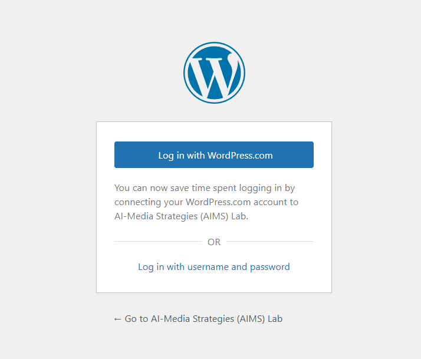

---

## 2. Adding a Research Post

Research Posts are academic publications, papers, or projects.

### Steps

1. In the left sidebar, click **Research Posts → Add New**

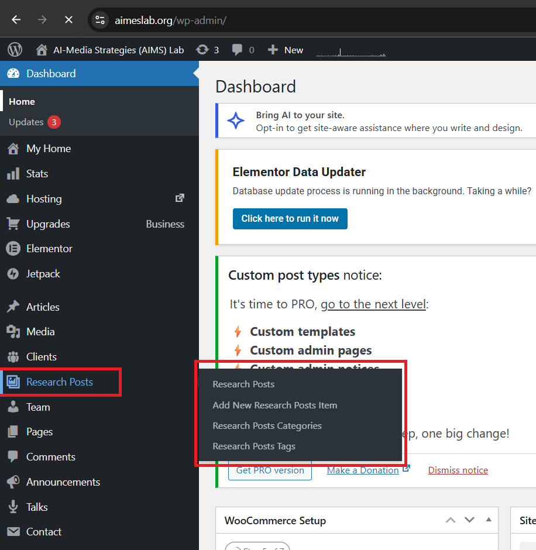

2. Fill in the **Title** (paper/project name)

3. In the main description/content area, keep it blank.

4. Scroll down to the **Portfolio Description** meta box. Fill in the description about the article.

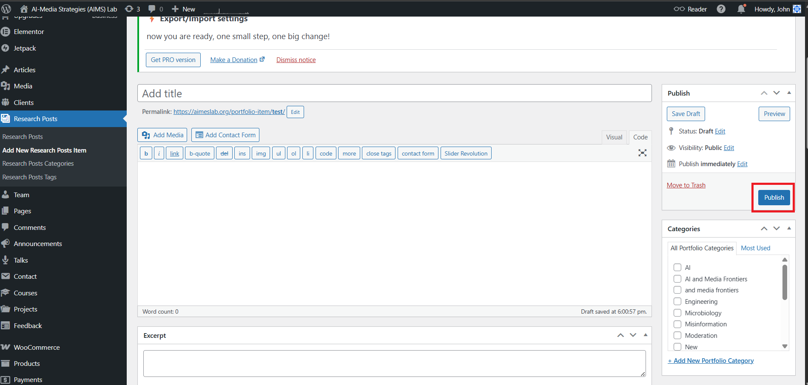

5. On the right sidebar:
   - Set **Categories** (e.g., AI, Media, Policy)
   > Note: Categories are linked to the homepage featured section. You can control which categories appear on the homepage through Elementor.
   - Set **Tags** if applicable
   - Upload a **Featured Image** (used as the card thumbnail)

6. Set **Status** to **Published** (or **Draft** to save without publishing)

7. Click **Publish** (or **Save Draft**)

---

## 3. Adding an Article

Articles are blog posts, op-eds, news updates, or commentary.

### Steps

1. In the left sidebar, click **Articles → Add New Article/Post**

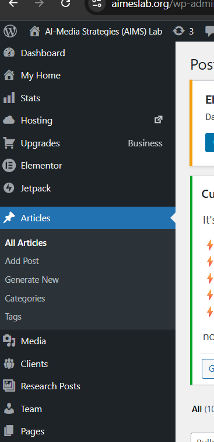

2. Fill in the **Title**

3. Write the article content in the editor. You can use:
   - The **Visual** tab for formatted editing (like Word)
   - The **Text** tab for HTML

4. On the right sidebar:
   - Set **Categories**
   - Add **Tags**
   - Upload a **Featured Image**

5. Click **Publish**

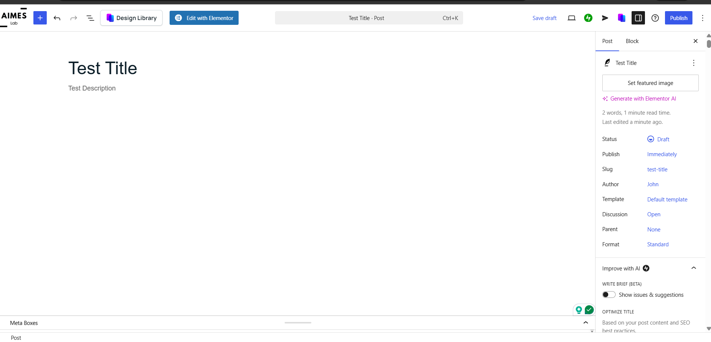

---

## 4. Adding a Team Member

1. In the left sidebar, click **Team → Add New**

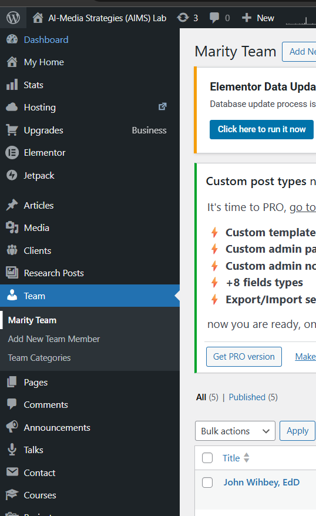

2. Enter the person's **name** as the title

3. Enter Role, upload a **Featured Image** — this becomes their profile photo
   > Recommended size: **400×400px**, square crop.
   Click **Save/Publish**.

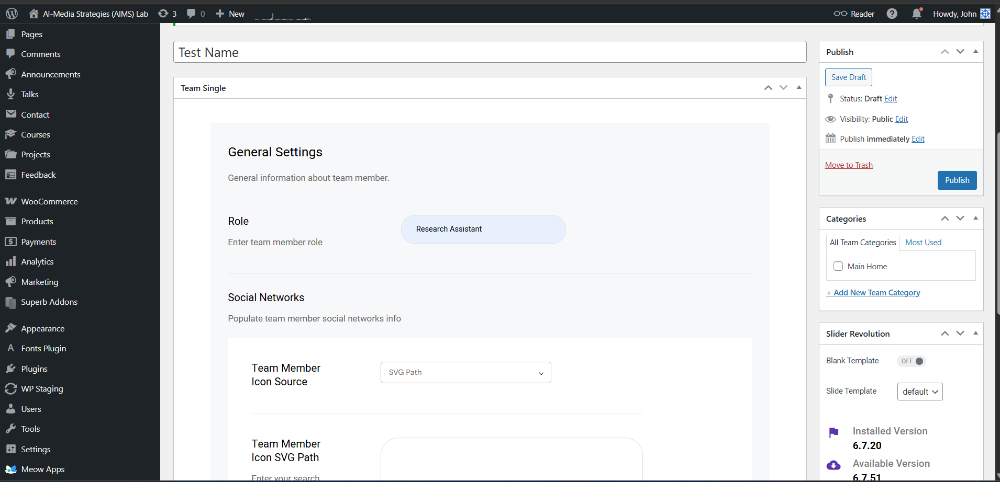

4. Go to **https://aimeslab.org/our-team/** and click **Edit with Elementor**

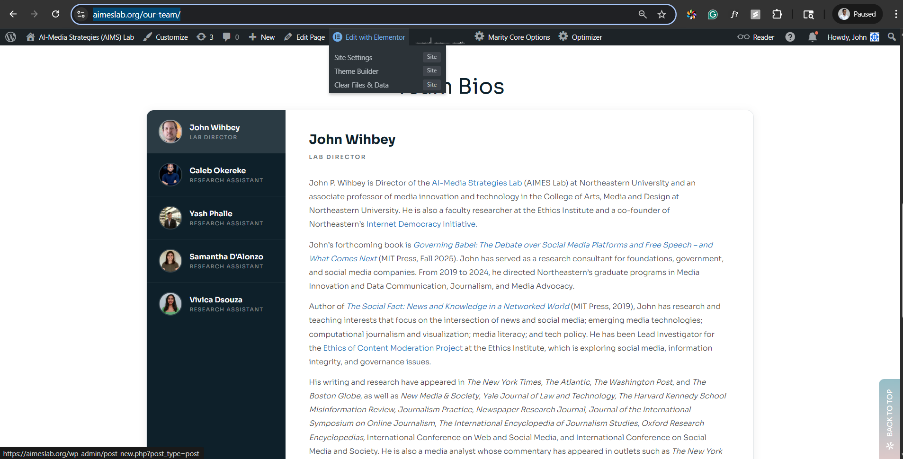

5. Click on the team bio section in the page, then select **Add New Item**

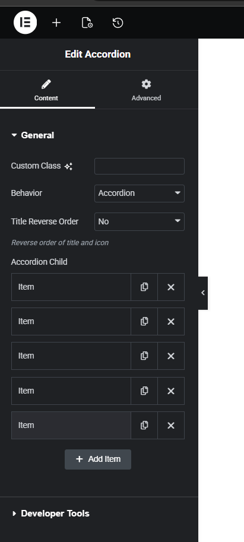

6. Write the bio in the text box. You can use HTML tags for bold/italic (e.g., `<strong>`, `<em>`)

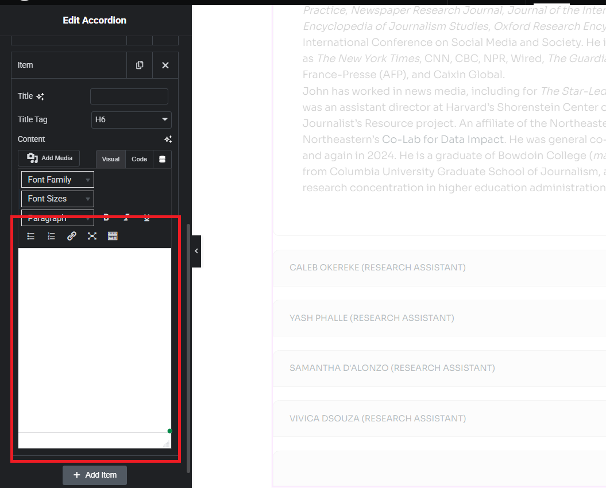

---

## 5. Adding a Talk / Seminar

Talks appear on the **Talks & Seminars** page (`/talks/`).

### Steps

1. In the left sidebar, click **Talks → Add New**

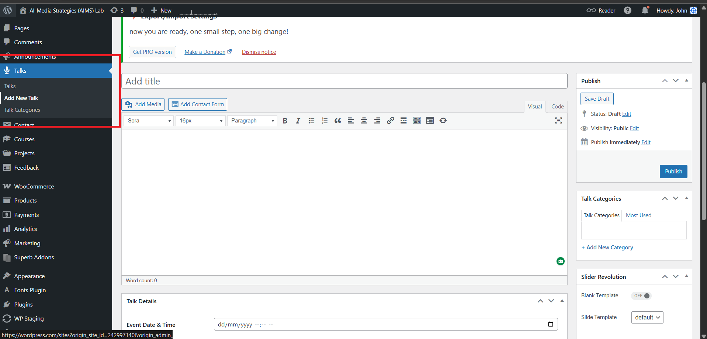

2. Enter the **talk title**

3. In the content area, write a **description / abstract**

4. Scroll down to the **Talk Details** meta box and fill in:
   - **Speaker Name**
   - **Speaker Bio / Affiliation**
   - **Date** (format: YYYY-MM-DD)
   - **Time** (e.g., 2:00 PM ET)
   - **Location** (room/building or "Virtual via Zoom")
   - **Type** — Upcoming or Past
   - **RSVP / Event Link** (optional)
   - **Recording URL** — YouTube or Vimeo link (add after the talk happens; leave blank to show "Unavailable")

5. Upload a **Featured Image** (speaker headshot or event banner)

6. Click **Publish**

> The talk will automatically appear on `/talks/` and in the homepage upcoming section if the date is in the future.

---

## 6. Updating the News Band (Homepage Marquee)

The scrolling news ticker at the top of the homepage is powered by **Announcements**.

### Adding a new announcement

1. In the left sidebar, click **Announcements → Add New**

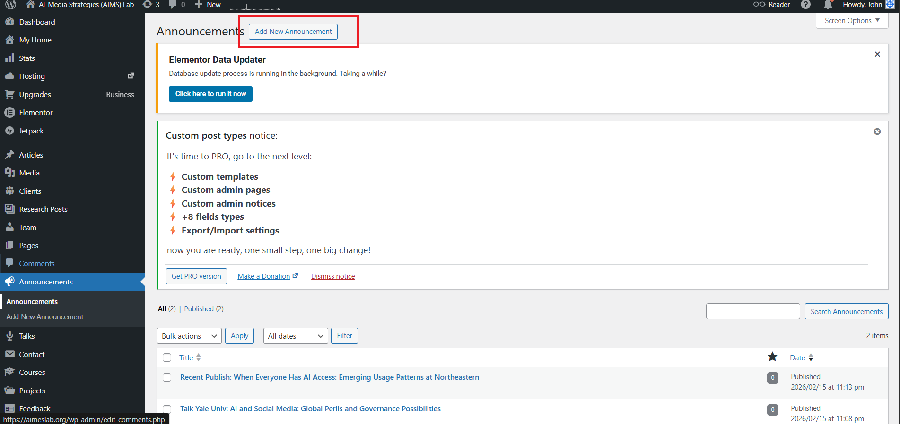

2. Enter the announcement **text** as the title
   Example: `New paper published in Nature AI — Read more`

3. In the **Announcement Link** field (below the editor), paste the URL to link to

4. Click **Publish**

> The announcement will immediately appear in the news band on the homepage.

### Removing an old announcement

1. Go to **Announcements → All Announcements**
2. Hover over the item → click **Trash**

---

## 7. Editing a Page (Elementor)

For pages like **Who We Are**, **Our Team**, **Homepage**, etc.

1. Go to **Pages → All Pages**
2. Find the page → click **Edit with Elementor**


3. Click on any element to edit it. Common actions:
   - **Text/heading** → click to type directly
   - **Image** → click → upload or select from media library
   - **Section layout** → click the outer border to adjust columns/spacing

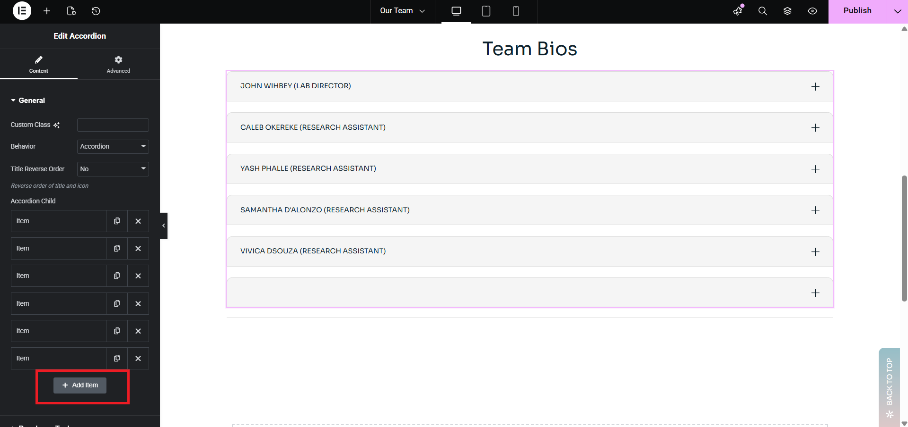

4. Click **Publish** (top right) when done

> **Tip:** Use **Ctrl+Z** to undo. Use the eye icon to preview before publishing.

---

## 8. Adding a Research Post from Slack [Coming Soon]

You can create Research Posts directly from Slack without logging into the admin panel.

### Setup (one-time)
> The AIMES Lab Bot must be installed in your Slack workspace. Contact the developer if not set up.

### Steps

1. In any Slack channel, type `/research` and press **Enter**

2. A form will pop up. Fill in:
   - **Title** — paper/project name
   - **Summary** — brief description
   - **Authors** — comma-separated
   - **Journal / Venue**
   - **Year**
   - **DOI / Link**
   - **Category**
   - **Tags**
   - **Status** — Draft or Published

3. Click **Submit**

4. The bot will send you a confirmation DM with a link to edit the post in WP Admin

5. The post appears in **WP Admin → Research Posts** immediately

---

## 9. Deploying Code Changes

Code changes (theme files) are deployed via **SFTP**.

### Files to deploy

| File | Location on server |
|------|--------------------|
| `functions.php` | `/wp-content/themes/marity-child/` |
| `style.css` | `/wp-content/themes/marity-child/` |
| `talk-preview.php` | `/wp-content/themes/marity-child/` |
| `aimes-private.php` | `/wp-content/themes/marity-child/` |

> **Never deploy** `aimes-private.php` through git — upload manually via SFTP only (contains API secrets).

### Steps

1. Open your SFTP client (FileZilla, Transmit, etc.)
2. Connect using: **`sftp://sftp/sftp%20wp`**
3. Navigate to `/wp-content/themes/marity-child/`
4. Upload the changed files (overwrite existing)
5. Hard-refresh the live site (**Ctrl+Shift+R**) to clear browser cache
6. If styles look wrong, go to **WP Admin → Elementor → Tools → Regenerate CSS**

---

## 10. Common Tasks Quick Reference

| Task | Where |
|------|--------|
| Add a research paper | Research Posts → Add New |
| Add a blog post / op-ed | Articles → Add New Article |
| Add a team member | Team → Add New |
| Add an upcoming talk | Talks → Add New |
| Add a news band item | Announcements → Add New |
| Edit homepage content | Pages → Homepage → Edit with Elementor |
| Edit "Who We Are" page | Pages → Who We Are → Edit with Elementor |
| Edit "Our Team" page | Pages → Our Team → Edit with Elementor |
| Change a featured image | Open post → Featured Image (right sidebar) |
| Unpublish something | Open post → Status → Draft → Update |
| Delete something | Posts list → Trash |
| Add research from Slack | Type `/research` in any channel |

---

## Notes for Developers

### Rules
- All customizations in `marity-child/` only — **never edit parent theme or plugin files**
- `marity/` — read only | `marity-core/` — read only
- Secrets (Slack tokens) live in `aimes-private.php` — not in git, deploy manually via SFTP
- Scope CSS with page-specific selectors (`.page-id-XXXX`, `.single-portfolio-item`)
- After CSS changes: hard refresh + Elementor → Tools → Regenerate CSS + Qode Optimizer → Clear Cache

### Repository Structure

```
├── README.md
├── CONTENT-MANAGEMENT-GUIDE.md
├── TEAMS-POST-SETUP.md
├── WP-ADMIN-EDITABILITY-AUDIT.md
└── app/public/wp-content/themes/
    └── marity-child/
        ├── functions.php        # All custom functionality
        ├── style.css            # All custom styles
        ├── talk-preview.php     # Talks & Seminars page template
        └── aimes-private.php    # API secrets (not in git)
```

### Tech Stack

| Layer | Technology |
|-------|-----------|
| CMS | WordPress |
| Page Builder | Elementor |
| Parent Theme | Marity by Qode Interactive (ThemeForest) |
| Child Theme | `marity-child` (this repo) |

### Required Plugins

| Plugin | Source |
|--------|--------|
| Marity Core | Bundled with Marity theme |
| Qode Framework | Bundled with Marity theme |
| Elementor | wordpress.org/plugins/elementor |
| Contact Form 7 | wordpress.org/plugins/contact-form-7 |
| Qode Optimizer | Bundled with Marity theme |

### Custom Features (Child Theme)

1. **Announcements CPT** — scrolling news ticker on homepage (`Dashboard > Announcements`)
2. **Talks & Seminars** — custom CPT with virtual page routing at `/talks/` and `/talks/?talk_id=ID`
3. **Research Post Enhancement** — HTML support in descriptions, featured image repositioning, grid cards
4. **Team Bio Sidebar** — transforms Elementor accordion into interactive sidebar layout on Our Team page
5. **Admin Renaming** — "Portfolio" → "Research Posts", "Posts" → "Articles" in WP Admin
6. **Slack Integration** — `/research` slash command creates Research Posts via modal form


