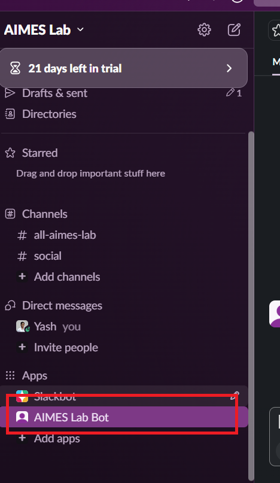
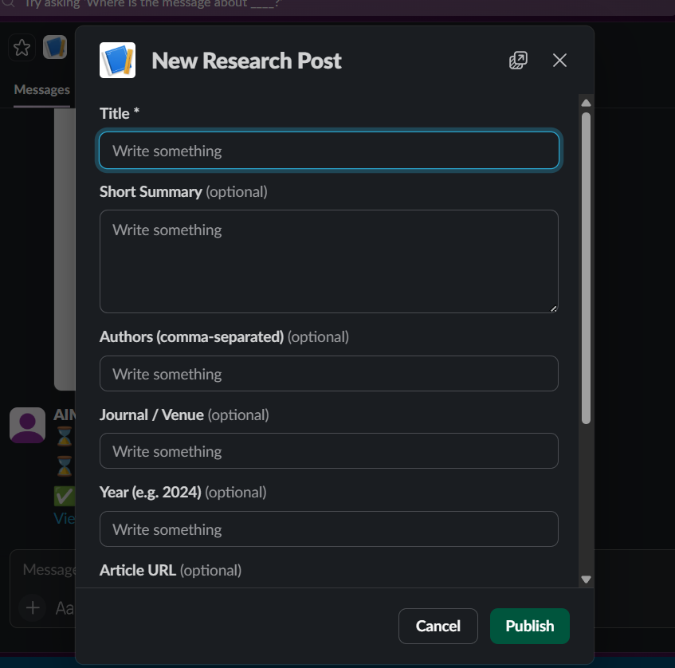
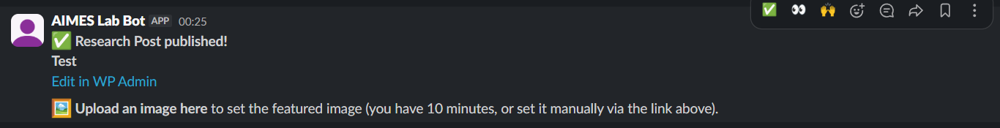
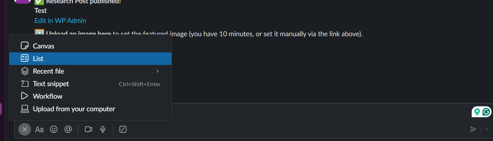
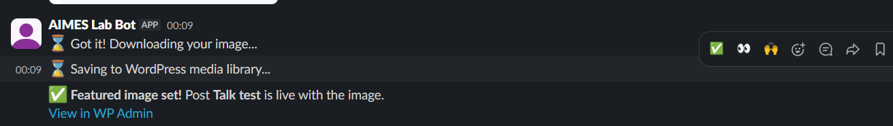

# AIMES Lab - Posting to the Website from Slack

You can create content on the AIMES Lab website directly from AIMES Lab Slack workspace without logging into WordPress admin. The bot supports four types of content, each with its own slash command.

---

## Available Commands

| Command | Creates |
|---------|---------|
| `/research` | Research Post (paper, project, publication) |
| `/article` | Article (blog post, op-ed, news) |
| `/talk` | Talk / Seminar |
| `/announce` | Homepage Announcement (scrolling ticker) |

---

## How It Works (Overview)

1. Type a slash command in AIMES LAB Bot DM and hit enter to send that command message.

2. A form (modal) pops up - fill in the fields

3. Click **Publish**
4. The bot DMs you a confirmation with a link to edit the post in WP Admin

5. For Research Posts, Articles, and Talks — the bot also asks you to **upload an image** in the DM to set the featured photo

6. The post goes live on the website immediately

---

## `/research` — New Research Post

Use this for papers, publications, and research projects.

### Steps

1. In any Slack channel, type `/research` and press **Enter**

2. A form will appear. Fill in the fields:

   | Field | Required | Description |
   |-------|----------|-------------|
   | **Title** | Yes | Full paper or project title |
   | **Short Summary** | No | Brief description shown on the post page |
   | **Authors** | No | Comma-separated, e.g. `Smith, J., Doe, A.` |
   | **Journal / Venue** | No | e.g. `Nature AI`, `NeurIPS 2024` |
   | **Year** | No | e.g. `2024` |
   | **Article URL** | No | Full URL to the paper or project page |
   | **Category** | No | Select from existing categories |
   | **Tags** | No | Comma-separated tags |

3. Click **Publish**

4. The bot will DM you:
   > ✅ *Research Post published!*
   > *[Post Title]*
   > [Edit in WP Admin]
   >
   > 🖼 *Upload an image here* to set the featured image (you have 10 minutes)

5. **Upload an image** directly in the bot DM — drag and drop or use the attachment button. The bot will:
   - Confirm it received the image
   - Download and save it to the WordPress media library
   - Set it as the featured image on the post
   - Send a final confirmation

> **Note:** If you don't upload an image within 10 minutes, you can still add one manually via the WP Admin link in the DM.

---

## `/article` — New Article

Use this for blog posts, op-eds, news updates, or commentary.

### Steps

1. Type `/article` and press **Enter**

2. Fill in the fields:

   | Field | Required | Description |
   |-------|----------|-------------|
   | **Title** | Yes | Article headline |
   | **Content** | No | Full article body text |
   | **Category** | No | Select from existing categories |
   | **Tags** | No | Comma-separated tags |

3. Click **Publish**

4. The bot DMs you a confirmation and asks for a featured image (same image upload flow as `/research`)

> **Tip:** For long articles with rich formatting (links, bold, headers), publish a draft from Slack and finish editing in WP Admin → Articles.

---

## `/talk` — New Talk / Seminar

Use this for upcoming or past talks and seminars.

### Steps

1. Type `/talk` and press **Enter**

2. Fill in the fields:

   | Field | Required | Description |
   |-------|----------|-------------|
   | **Talk Title** | Yes | Full title of the talk |
   | **Abstract / Description** | No | Talk description or abstract |
   | **Speaker Name** | Yes | Full name of the speaker |
   | **Speaker Bio / Affiliation** | No | Short bio or institution |
   | **Date** | Yes | Pick from date picker |
   | **Time** | Yes | Pick from time picker |
   | **Location / Room** | No | e.g. `Room 101, Building A` or `Virtual via Zoom` |
   | **Zoom / Virtual Link** | No | Full Zoom or meeting URL |
   | **RSVP / Registration URL** | No | URL for event registration |

3. Click **Publish**

4. The bot DMs you a confirmation and asks you to upload a **speaker headshot or event banner** in the DM

5. Upload the image in the DM — it will be set as both the featured image and the speaker photo displayed on the talks page

> **Note:** The talk will automatically appear as "Upcoming" on the `/talks/` page if the date is in the future, and move to "Past" after it passes.

---

## `/announce` — New Announcement

Use this to add an item to the **scrolling news ticker** at the top of the homepage.

### Steps

1. Type `/announce` and press **Enter**

2. Fill in the fields:

   | Field | Required | Description |
   |-------|----------|-------------|
   | **Announcement Text** | Yes | The text that scrolls in the ticker, e.g. `New paper published in Nature AI — Read more` |
   | **Link URL** | No | URL the announcement links to when clicked |

3. Click **Publish**

4. The bot DMs you a confirmation — the announcement appears on the homepage immediately

> **To remove an announcement:** Go to WP Admin → Announcements → hover over the item → Trash

---

## Uploading a Featured Image (via DM)

After publishing a Research Post, Article, or Talk, the bot will message you:

> 🖼 *Upload an image here* to set the featured image (you have 10 minutes)

**To upload:**
- Open the bot DM
- Click the **+** or attachment icon in the message bar
- Select your image file (JPG, PNG, etc.)
- Send it — no message text needed, just the image

The bot will send status updates:
- ⏳ *Got it! Downloading your image...*
- ⏳ *Saving to WordPress media library...*
- ✅ *Featured image set! Post [Title] is live with the image.*

**Recommended image sizes:**
- Research Posts: `1200×800px` or wider (landscape)
- Articles: `1200×800px` or wider
- Talks: `400×400px` square (speaker headshot) or `1200×600px` (event banner)

---
